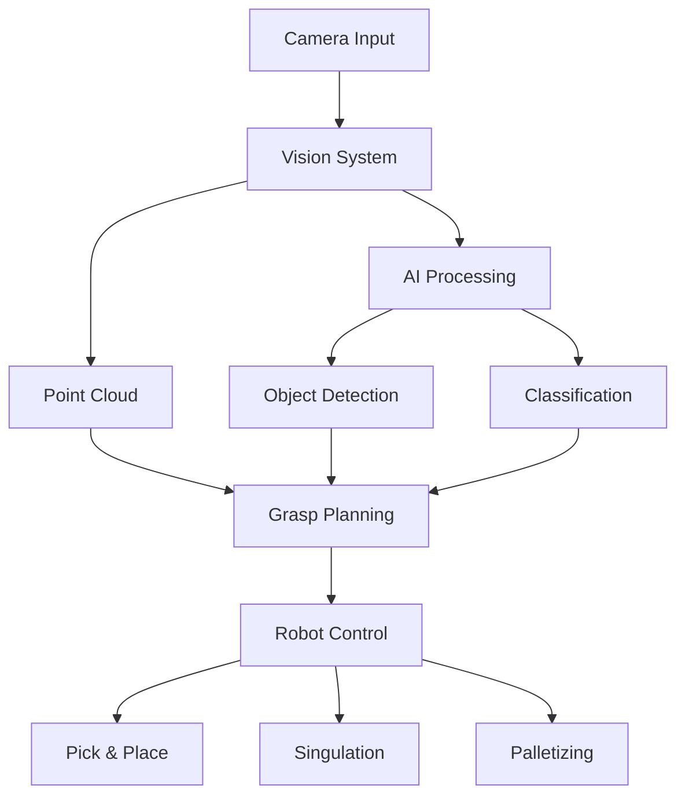

## Introduction

<Info>
  Fizyr provides state-of-the-art deep-learning vision software designed for
  industrial automation. Our solutions enable precise and efficient handling
  across diverse applications, delivering comprehensive vision-based
  functionalities for robotic systems.
</Info>

## Core Features

### Data Acquisition

Our software streamlines the data acquisition process through advanced camera operations management:

- Robot-Camera Calibration
- Image Processing
- Status Monitoring
- Real-time Feedback

### Supported Camera Families

| Camera Type                   | Description                 |
| ----------------------------- | --------------------------- |
| Ensenso N series              | With IDS uEye cameras       |
| Ensenso X series              | With IDS uEye cameras       |
| Zivid 2 series                | High-performance 3D cameras |
| Matrix Vision rc color series | Industrial vision solutions |
| Mechmind series               | AI-powered vision systems   |

### Detection and Processing

Our AI-based detection system combines advanced algorithms with real-time processing to ensure accurate and efficient object handling:

- Accurate item segmentation
- Shape and material classification
- Custom descriptor support
- Real-time processing capabilities

### Grasp Pose Estimation

The software calculates optimal grasp poses by considering multiple factors including object properties, gripper capabilities, and environmental constraints.

## Technical Architecture

### System Components

- Integrated Cameras
- Industrial PC
- PLC Integration
- Picking Robot

## Integration Guidelines

1. Hardware Setup
2. Software Configuration
3. Maintenance

For technical support and additional resources, contact our support team.
